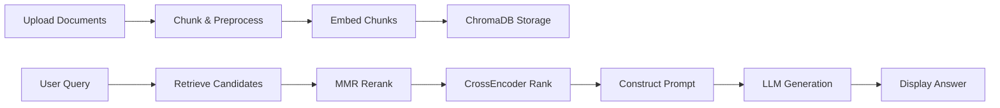
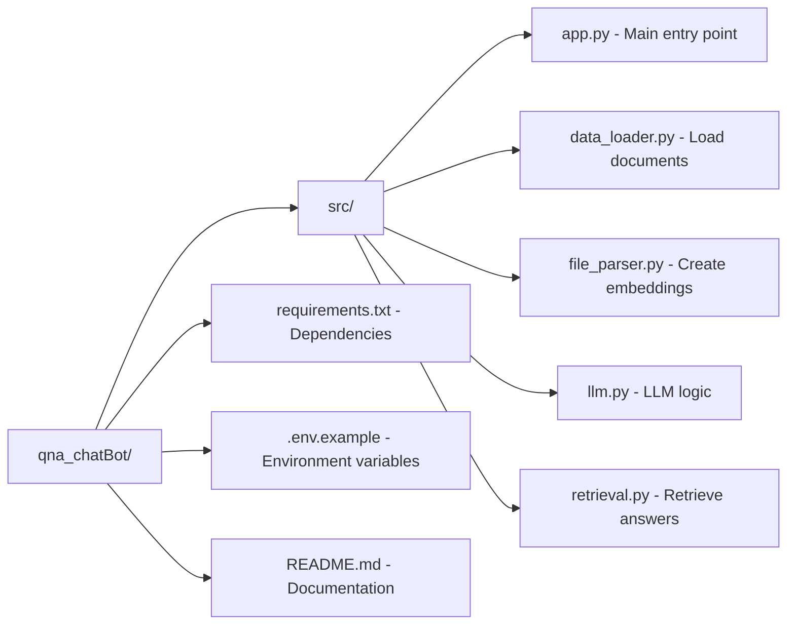

# QnA ChatBot🤖

A conversational Q\&A chatbot built with Python, designed to answer user queries based on a specified knowledge base. This project leverages modern language models and retrieval techniques to provide accurate, context-aware responses.

---

## Table of Contents

1. [Project Overview](#project-overview)
2. [Features](#features)
3. [Architecture](#architecture)
4. [Workflow](#workflow)
5. [Installation](#installation)
6. [Configuration](#configuration)
7. [Usage](#usage)
8. [Project Structure](#project-structure)
9. [Future Enhancements](#future-enhancements)
10. [Contributing](#contributing)

---

## Project Overview

The QnA ChatBot is a standalone Python application that allows users to interact with a chatbot interface to ask questions and receive answers drawn from a custom document corpus or predefined datasets. It combines document loaders, embeddings, a vector store, and an LLM to facilitate a Retrieval-Augmented Generation (RAG) pipeline.

## Features

* *Document Ingestion:* Load and parse various document formats (PDF, DOCX, TXT).
* *Preprocessing:* Text splitting and cleaning to prepare content for embedding.
* *Embeddings:* Generate semantic embeddings for document chunks.
* *Vector Store:* Store and index embeddings for efficient similarity search.
* *Retrieval:* Fetch top-k relevant document segments based on user queries.
* *Response Generation:* Use an LLM (e.g., OpenAI GPT) to generate context-aware answers.
* *Interactive UI:* Simple command-line or web interface (Flask/Streamlit) for real-time Q\&A.

 ## 🏗️ Architecture

## Workflow

1. *User Query:* The user submits a question via the UI.
2. *Preprocessing:* The raw documents are split into manageable chunks and cleaned.
3. *Embedding:* Each chunk is converted into a vector embedding.
4. *Indexing:* Embeddings are stored in a vector database for similarity search.
5. *Retrieval:* Given the user query, top-k relevant chunks are retrieved.
6. *Context Assembly:* Retrieved chunks are assembled into a prompt context.
7. *Answer Generation:* An LLM generates a response based on the provided context.
8. *Display:* The answer is returned to the user through the UI.

## Installation

1. *Clone the repository*

   bash
   git clone https://github.com/Laiba-iman25/qna_chatBot.git
   cd qna_chatBot
   

2. *Create a virtual environment*

   bash
   python3 -m venv venv
   source venv/bin/activate   # On Windows: venv\\Scripts\\activate
   

3. *Install dependencies*

   bash
   pip install --upgrade pip
   pip install -r requirements.txt
   

> *Note:* Ensure you have Python 3.8+ installed.

## Configuration

1. *API Keys*

   * Create a .env file in the project root.
   * Add your GROQ API key:

     ini
     GROQ_API_KEY=your_api_key_here
     
2. *Environment Variables*

   * Refer to .env.example for any additional variables.

## Usage

1. *Run the application*

   * *Command-line* (if supported):

     bash
     python app.py
     
   * *Streamlit* (if UI uses Streamlit):

     bash
     streamlit run app.py
     

2. *Interact via UI*

   * Open http://localhost:8501 (default) in your browser.
   * Enter your query and press *Submit*.

3. *Stop the app*

   * Press Ctrl+C in the terminal or stop the Streamlit process.

## Project Structure

## Future Enhancements

🌍 Multilingual Support – Process documents and queries in multiple languages.

🔐 User Authentication – Allow login and personalized document storage.

📜 Chat History – Retain prior interactions within sessions.

🎨 UI Upgrades – Add dark/light mode, drag & drop uploads, theme support.

🧠 Persistent Memory – Store previous document interactions for long-term use.

📤 Export Responses – Download answers and context in PDF/CSV format.

## Contributing

1. Fork the repository.
2. Create a feature branch: git checkout -b feature/your-feature.
3. Commit your changes: git commit -m "Add your feature".
4. Push to your branch: git push origin feature/your-feature.
5. Open a Pull Request.

Made by Laiba Iman 🧸